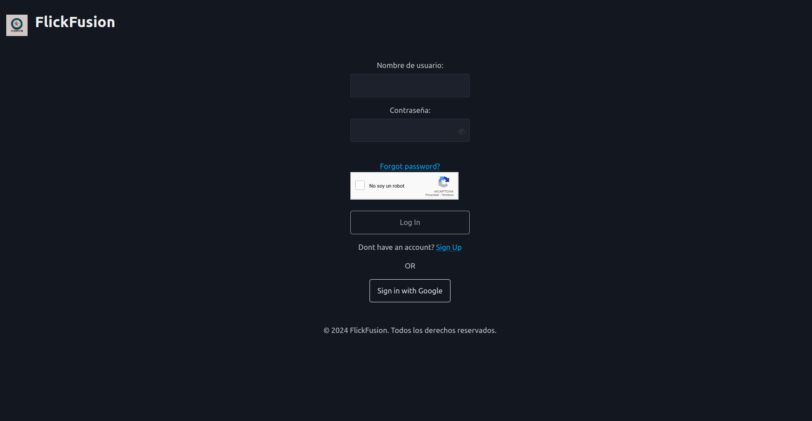

# Flick Fusion

[comment]: # (Incluir una breve descripción del proyecto en una o dos frases como mucho)

Aplicación web basada en Express.js que permite registrarse (tanto por correo como por google), comprar peliculas y ver información de dichas peliculas realizada para la asignatura de Aplicaciones Web de 3º de Ingenieria Informatica de la Universidad de León

[comment]: # (Incluir un GIF o una captura de pantalla de la página principal del proyecto. Utilizar el directorio docs para almacenar dicha imagen)



## Tabla de contenidos

- [Flick Fusion](#flick-fusion)
  - [Tabla de contenidos](#tabla-de-contenidos)
  - [Introducción](#introducción)
    - [Características](#características)
    - [Tecnologías](#tecnologías)
  - [Uso de la aplicación](#uso-de-la-aplicación)
    - [Instalación](#instalación)
    - [Configuración](#configuración)
    - [Ejecución](#ejecución)
  - [Cambios adicionales](#cambios-adicionales)
  - [Créditos](#créditos)

## Introducción

### Características

[comment]: # (Enumerar las principales características que ofrece la aplicación web, siguiendo el formato:)

* Registro de usuarios (correo convencional y Google)
* Obtener informacion de las ultimas peliculas
* Comprar peliculas
* Editar foto de perfil y contraseñas

### Tecnologías

[comment]: # (Enumerar todas las APIs o librerías externas utilizadas en el proyecto pero sin mencionar las APIs DOM y fetch, Express ni Mongoose. El formato será como sigue:)

Este proyecto ha sido desarrollado utilizando:

* [Express](https://expressjs.com/) - Framework web.
* [Mongoose](https://mongoosejs.com/) - ODM para trabajar con una base de datos MongoDB.
* [Dotenv](https://mongoosejs.com/) - Carga variables de entorno desde archivos .env.
* [Cors](https://www.npmjs.com/package/cors) - Middleware para permitir CORS en Express.
* [Bcrypt](https://www.npmjs.com/package/bcrypt) - Cifrado de contraseñas.
* [Cookie-parser](https://www.npmjs.com/package/cookie-parser) - Permite el analisis de cookies en Express
* [Jsonwebtoken ](https://www.npmjs.com/package/jsonwebtoken) - Permite la autenticación segura basada en tokens
* [Nodemailer](https://nodemailer.com/) - Envió de correos.
* [Path](https://www.npmjs.com/package/path) - Utilidades para trabajar con rutas de archivos.
* [Passport](https://www.passportjs.org/) - Middleware de autenticación flexible.
* [Passport-google-oauth20](https://www.passportjs.org/packages/passport-google-oauth20/) - Autenticación con Google OAuth 2.0.
* [Express-session](https://www.npmjs.com/package/express-session) -  Gestiona sesiones de usuario en Express.
* [Stripe](https://docs.stripe.com/libraries?locale=es-ES) - Plataforma de pagos en línea.
* [SASS](https://sass-lang.com/) - Herramienta que facilita la escritura de css.
* [ChartJS](https://www.chartjs.org/) - Nos permite crear graficos de diferente tipo
* [Googleapis](https://www.npmjs.com/package/googleapis) - Nos permite acceder a url de YT
* [EJS](https://www.npmjs.com/package/ejs) - Nos permite crear html de forma dinámica en el servidor
* [Multer](https://www.npmjs.com/package/multer) - Permite implementar la logica de subida de archivos
* [Nodemon](https://www.npmjs.com/package/nodemon) - Permite el deploy de manera automática cada vez que detecte un cambio
## Uso de la aplicación

[comment]: # (Describir cómo instalar, configurar y ejecutar la aplicación web. El formato será como sigue:)

### Instalación

Clonar este repositorio y ejecutar desde el directorio raíz el siguiente comando para instalar las dependencias:

```bash
$ npm install
```

[comment]: # (Si es necesario hacer alguna tarea más compleja, como por ejemplo compilar código SASS, indicar a continuación cómo se debería hacer. Este tipo de tareas deberán estar automatizadas con npm build)

Antes de desplegar la aplicación, es necesario generar el estilado frontend utilizando el siguiente comando desde el directorio raíz (src):

```bash
$ npm run build
```

### Configuración

[comment]: # (Enumerar todos los parámetros configurables de la aplicación web, sin incluir ningún dato sensible)

Crear un fichero `.env` en el directorio raíz que defina las siguientes variables de entorno:

```bash
# Puerto utilizado por el servidor de la aplicación
APP_PORT=
# URI de la base de datos
MONGODB_URI=
# User de la base de datos
MONGO_USER=
# Password de la base de datos
MONGO_PASSWORD=
# Correo encargado del envío de los correos
MAIL_USER=
# Contraseña de dicho correo
MAIL_PASS=
# Key con la que se firma el token
JWT_KEY=
# Clave pública de Google OAuth 2.0
GOOGLE_CLIENT_ID=
# Clave secreta de Google OAuth 2.0
GOOGLE_CLIENT_SECRET=
# Clave secreta para la sesión de usuario
SESSION_SECRET=
# Clave secreta de Stripe para autorización de pagos
STRIPE_SECRET_KEY=
# Clave secreta para usar TMDB
API_KEY_TMDB=
# URL callback login google
CALLBACK_GOOGLE_URL=
# URL en la que desplegar la app
PROD_URL=
# Key para el captcha
RECAPTCHA_SECRET_KEY=
```
  NOTA: Para facilitar la corrección de la practica se adjuntan las API Keys en la memoria, en el apartado 1.4, para evitar configuraciones de Google Cloud Platform para los correos, STRIPE para los pagos, para probar las opciones de admin, etc etc
### Ejecución

Para ejecutar la aplicación web, ejecutar el siguiente comando desde el directorio raíz:

```bash
$ npm start
```
## Cambios adicionales
Además de las funcionalidades y características principales descritas, se han implementado los siguientes cambios y mejoras:
- **Cambios en las URLs:** Se han realizado modificaciones en las URLs para mejorar la estructura y el acceso.
- **Cambio en la lógica de multimedia:** Ahora la información multimedia se obtiene directamente desde la API, almacenando en la base de datos solo las películas compradas.
- **Mejora en la lógica de filtros:** Se ha optimizado la lógica de los filtros para una mejor experiencia de usuario.
- **Corrección de duplicados al comprar:** Se ha solucionado el error de duplicados al realizar una compra.
- **Mejora en las alertas:** Las alertas se han convertido en divs/modales, como en los formularios de login y signUp.
- **Actualización en la generación de páginas:** Se ha mejorado la lógica para la generación de páginas de verificación y no verificación.
- **Reorganización del código:** Se han realizado cambios generales en la ubicación de los métodos en los archivos de renderizado y APIs.
- **Implementación de lógica de "Forgot Password":** Ahora es posible recuperar contraseñas olvidadas.
- **Integración de Multer:** Se ha implementado Multer para la carga de fotos de perfil.
- **Mejoras en la seguridad de contraseñas:** Las contraseñas ahora son más seguras.
- **Implementación de Captcha:** Se ha añadido un captcha para mejorar la seguridad en el formulario de login.
- **Visualización de contraseña:** Se ha añadido la posibilidad de ver la contraseña en el formulario de login.

## Créditos

Este proyecto ha sido desarrollado por el grupo *G09*, formado por:

* Javier Troyano
* Carolina Macho
* Christian Castro
* Oscar Diez
* Mouhcine El Oualidi
 
